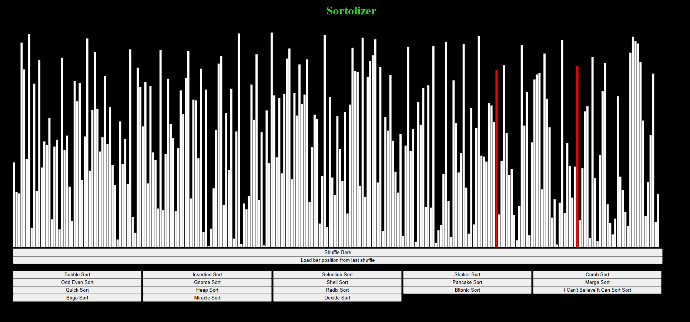
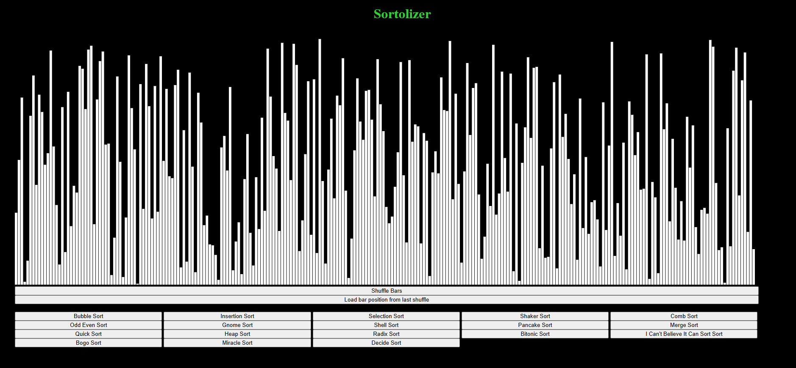
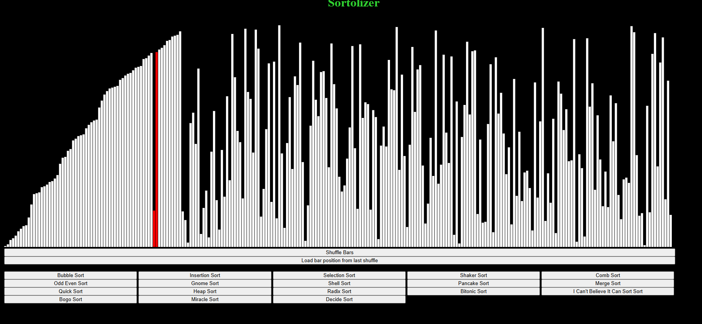
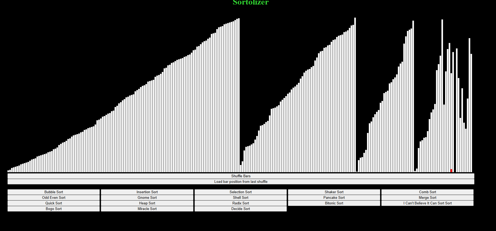
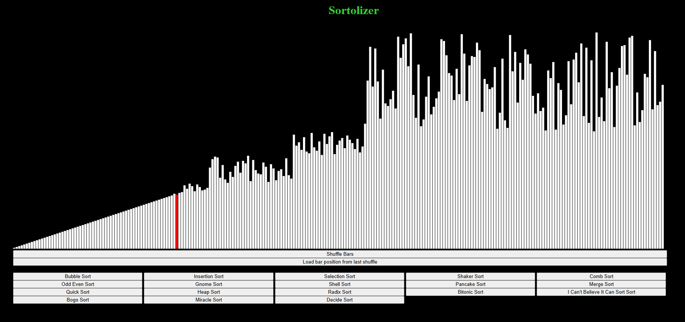
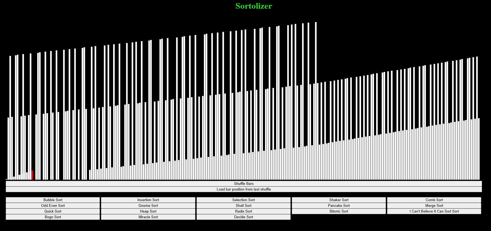

# Overview
The Sortoliser was created to serve as a learning tool to help people understand the process behind a variety of sorting algorithms. It is written primarily in JavaScript and designed to be used and interacted with as a webpage. I hoped that, by making this project, I would be able to learn more about JavaScript and learn a variety of common sorting algorithms myself. This is also the program I used to create a series of shorts and a video on my YouTube channel.

# How to use
The website is very easy to use. Just head to https://thesupernile.github.io/Sortolizer or visit the website hosted in the deployment section of this repository (this is the same place but two ways to access it).
Click the button to shuffle the list then choose the sorting algorithm you want to visualise. Once visualisation has started, the program will not allow you to visualise another algorithm or shuffle the bars until sorting is complete (with the exception of bogo which you can stop by pressing the button for bogo sort again). If you want to cancel the visualisation, you will need to reload the page

# Features
* Full Visualisation of sixteen different sorting algorithms
* Sound effects when bars are swapped
* Ability to restore the positon of the bars to the last shuffled configuration (for better comparison)

# Implemented Algorithms
* Fisher-Yates Shuffling

* Bubble Sort
* Insertion Sort
* Selection Sort

* Shaker Sort
* Odd Even Sort
* Gnome Sort
* Pancake Sort
* Radix Sort

* Comb Sort
* Shell Sort

* Merge Sort
* Heap Sort
* Quick Sort
* Bitonic Sort
* I Can't Believe It Can Sort Sort

Plus the joke sorts:

* Bogo Sort
* Miracle Sort
* Decide Sort

# Screen Shots Of Program Operation

Bars Fully Shuffled:

Insertion Sort:

Merge Sort:

Quick Sort:

Radix Sort:

